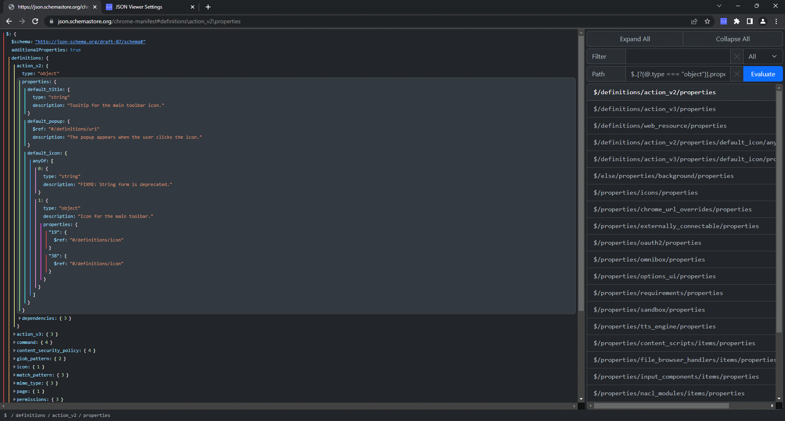

# Json Explorer
A modern browser extension to visualise, traverse and search JSON. Made with [Svelte](https://svelte.dev/) and [bootstrap](https://getbootstrap.com/).

## Features
* Yes/no prompt to load detected JSON on non-whitelisted domains
* Expand and collapse objects and arrays recursively
* [JSON5](https://json5.org/) syntax support
* Copy formatted or minified JSON values
* Navigate to sibling or child properties using the arrow keys
* Creates hyperlinks for URL strings
* A path editor with auto-complete
* A breadcrumb trail to the current property
* Navigate to previously selected properties using your browser history
* Search for text in keys, values or both
* Evaluate JPath expressions
* Dark and light mode
* Customizable colour schemes

## Building
The project is built using rollup. The following options can be passed into rollup to be used by the build script:
 * `--browser <name>` - Currently only supports "chrome" or "firefox"
 * `--dist` - If specified, will minify files and archive the output

The build script uses the following files:
 * "src/content/content.ts": The UI for the prompt that is shown on non-whitelisted pages
 * "src/content-script/content-script.js": The content script of the extension.
 * "src/options/options.ts": The UI for the options page
 * "src/viewer/viewer.ts": The UI for the main viewer component
 * "custom-manifest.json": Used to generate a browser-specific manifest.json file