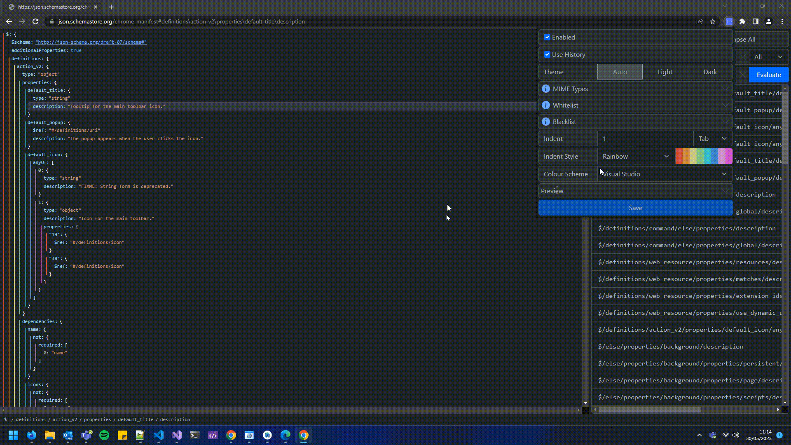

# Json Explorer
An extension for Google Chrome to visualise, traverse and search JSON.

## Features
* Yes/no prompt to load detected JSON on non-whitelisted domains
* Expand and collapse objects and arrays recursively
* Copy formatted or minified JSON values
* Keyboard shortcuts for navigating the properties in the selected property
* A path editor with auto-complete
* A breadcrumb trail to the current property
* Navigate to previously selected properties using the browser history
* Search for text in keys, values or both
* Evaluate JPath expressions
* Dark and light mode
* Customizable colour schemes