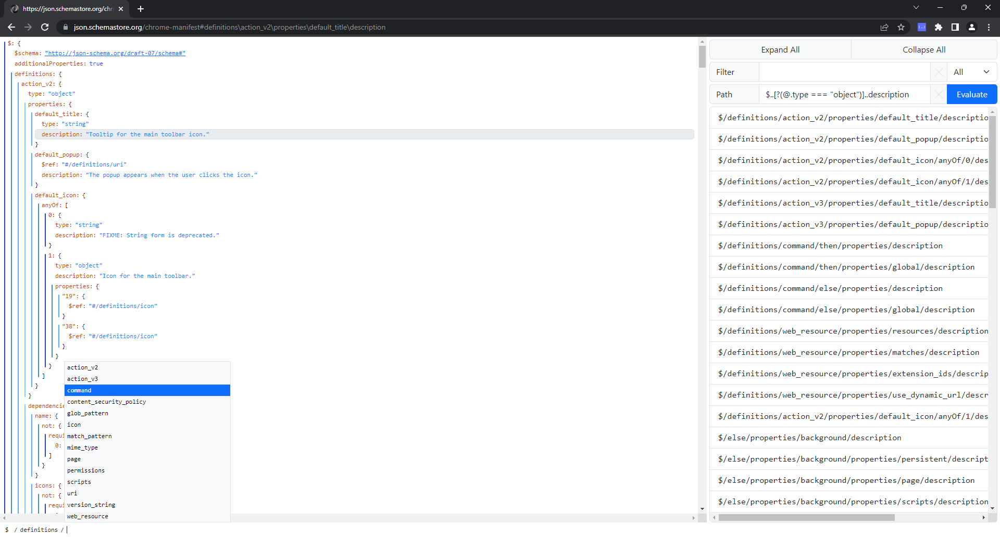

# Json Explorer
An extension for Google Chrome to visualise, traverse and search JSON.

## Features
* Expand and collapse objects and arrays recursively
* Copy formatted or minified JSON values
* Navigate the JSON using a breadcrumb of properties
* Navigate using the path editor with autocompletion
* Search for text in keys, values or both
* Evaluate JPath expressions
* Dark and light mode
* Customizable colour schemes
* Yes/no prompt to load detected JSON on non-whitelisted domains
* Navigate and copy properties using the keyboard
* Navigate to previously selected properties using the browser history