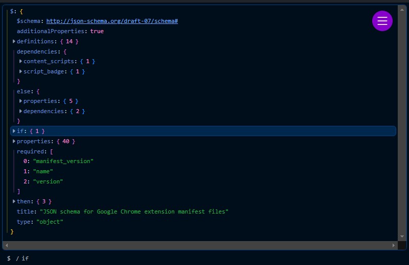
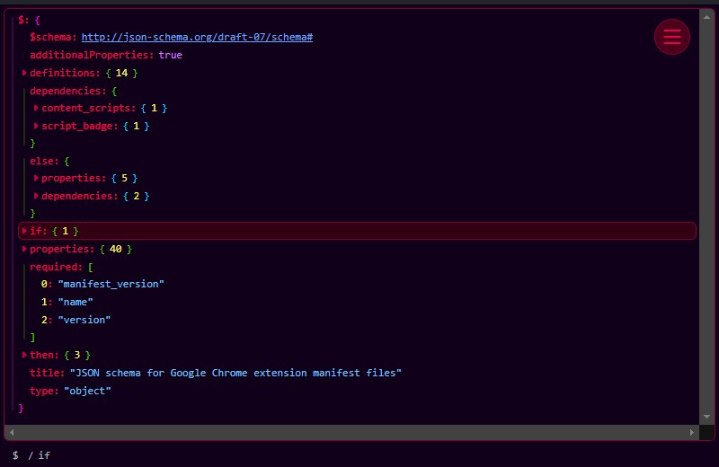
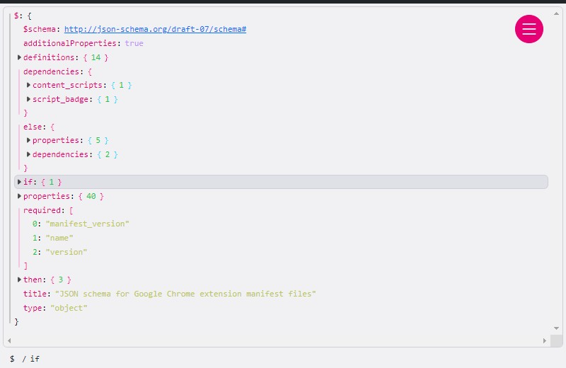
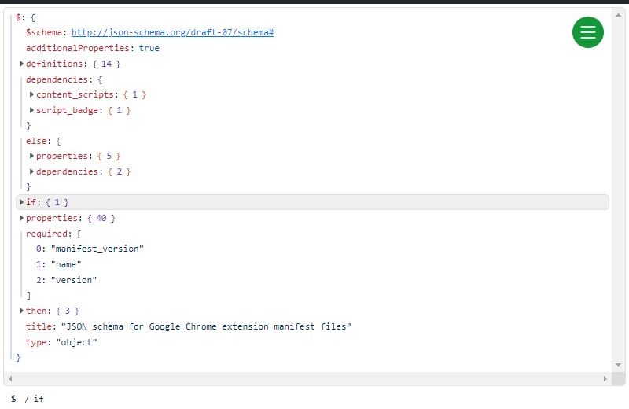
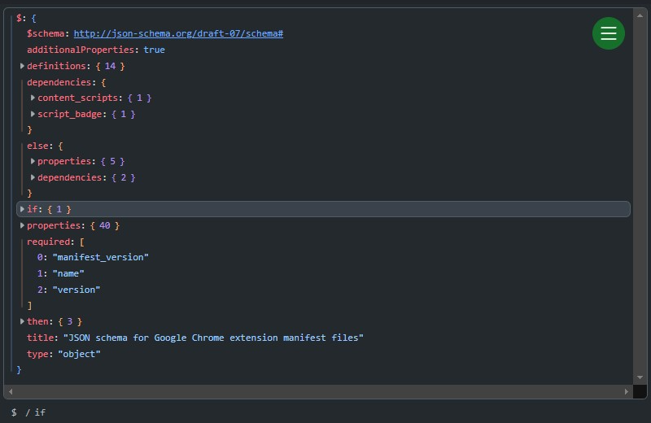
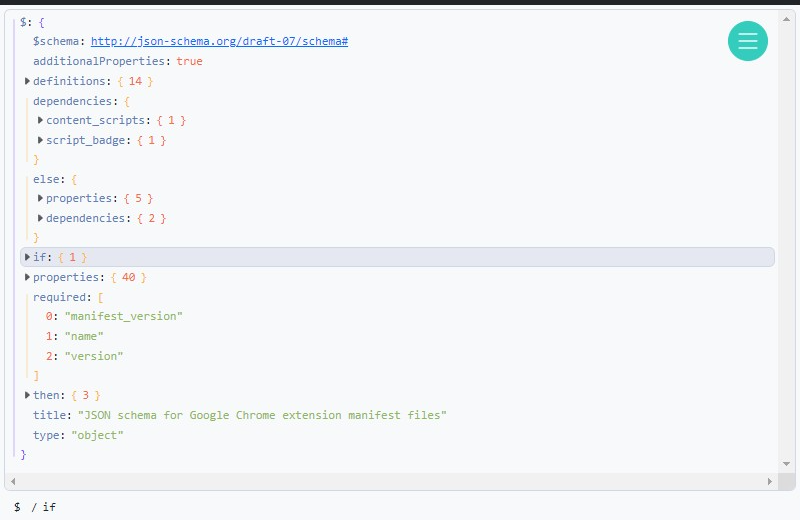
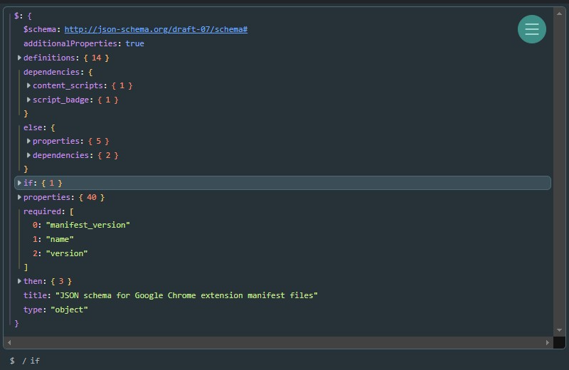
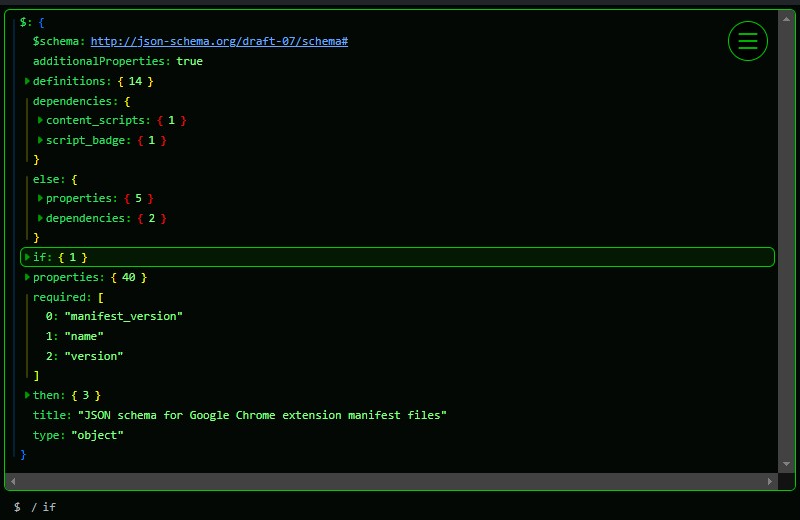

# Json Explorer
A modern browser extension to visualise, traverse and search JSON. Made with [Svelte](https://svelte.dev/) and [bootstrap](https://getbootstrap.com/).

	
See all themes

	<table style="overflow-x:scroll;">
		<thead>
			<tr>
				<th>Name</th>
				<th>Light</th>
				<th>Dark</th>
			</tr>
		</thead>
		<tbody>
			<tr>
				<td>Visual Studio</td>
				<td>
					
				</td>
				<td>
					
				</td>
			</tr>
			<tr>
				<td>Abyss</td>
				<td>N/A</td>
				<td>
					
				</td>
			</tr>
			<tr>
				<td>Cyberpunk</td>
				<td>N/A</td>
				<td>
					
				</td>
			</tr>
			<tr>
				<td>Dracula</td>
				<td>
					
				</td>
				<td>
					
				</td>
			</tr>
			<tr>
				<td>GitHub</td>
				<td>
					
				</td>
				<td>
					
				</td>
			</tr>
			<tr>
				<td>Material</td>
				<td>
					
				</td>
				<td>
					
				</td>
			</tr>
			<tr>
				<td>Matrix</td>
				<td>N/A</td>
				<td>
					
				</td>
			</tr>
			<tr>
				<td>Monokai</td>
				<td>
					
				</td>
				<td>
					
				</td>
			</tr>
			<tr>
				<td>Solarized</td>
				<td>
					
				</td>
				<td>
					
				</td>
			</tr>
		</tbody>
	</table>

## Features
* Yes/no prompt to load detected JSON on non-whitelisted domains
* Expand and collapse objects and arrays recursively
* Support for [JSON5](https://json5.org/) syntax
* Copy formatted or minified JSON values
* Navigate to sibling or child properties using the arrow keys
* Creates hyperlinks for URL strings
* A path editor with auto-complete
* A breadcrumb trail to the current property
* Navigate to previously selected properties using your browser history
* Search for text in keys, values or both
* Evaluate JPath expressions
* Dark and light mode
* Customizable colour schemes

## Building
The project is built using rollup. The following options can be passed into rollup to be used by the build script:
 * `--browser <name>` - Currently only supports "chrome" or "firefox". Defaults to "chrome" if not specified.
 * `--dist` - If specified, will minify files and archive the output.

The build script uses the following files:
 * `src/content/content.ts`: The UI for the prompt that is shown on non-whitelisted pages.
 * `src/content-script/content-script.js`: The content script of the extension.
 * `src/options/options.ts`: The UI for the options page.
 * `src/viewer/viewer.ts`: The UI for the main viewer component.
 * `custom-manifest.json`: Used to generate a browser-specific manifest.json file.
 * `res`: The contents of this folder are copied to the output directory.

The build will output the extension to `./out/<browser>`.

## TODO
- [x] Undo / redo edits
- [x] Allow multiple properties to be selected
- [x] Support `?.` chain expressions in JPath evaluator
- [x] Support special characters in the json path editor
- [x] Show HTTP headers
- [ ] Allow modified JSON to be used in POST/PUT requests